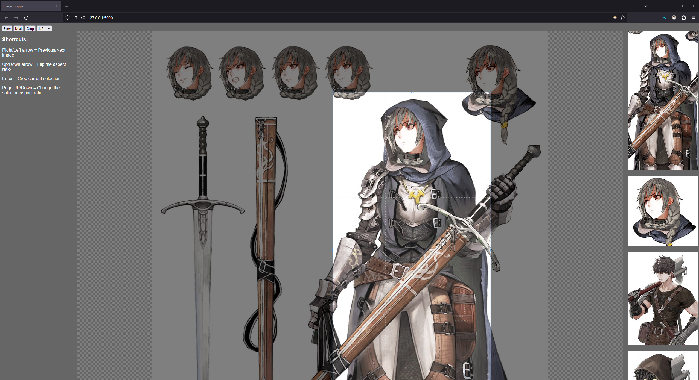

# KottCropper

A simple tool for cropping images to a specific aspect ratio, useful for cropping large number of images, for example if you are training a LORA.

Birme.net lacks the ability to crop only specific parts of an image, so I made this tool to do that.

I can bearly code so this is probably a mess, but it works.

  

## Usage
Install requirements

    pip install flask pillow

Download the repo

    https://github.com/kooten111/KottCropper

Go to \Static\cropped_images and put the images you want to crop there. 

Run the app
    
    python Cropper.py

Go to `localhost:5000` in your browser and start cropping.

Your cropped images will be in \Static\cropped_images\cropped

## Todo
- [ ] Flipping the aspect ratio does not work as intended